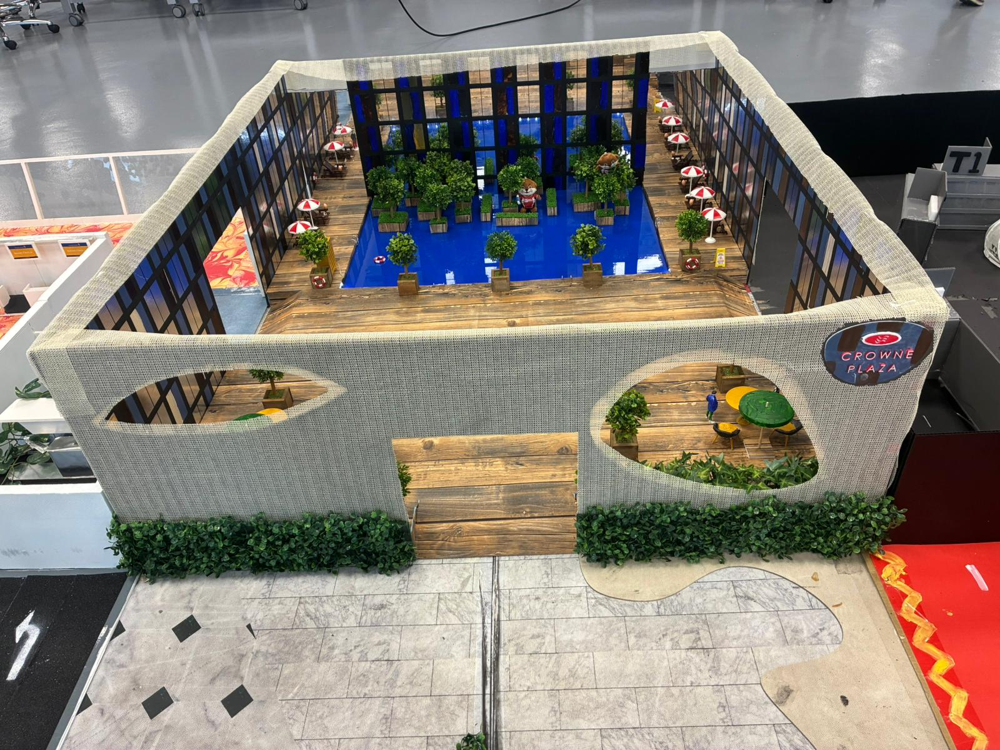

# PORTFOLIO

# LIMO Robotics Systems Engineering Portfolio

This site showcases the **LIMO Robot Project**, developed as part of a hands-on training exercise in **robotics systems engineering**. It demonstrates both technical implementation and project management using systems engineering principles.

---

## Project Overview – “What”

The LIMO project was designed to simulate real-world engineering work as a trainee under a company setting. The goal was to build an arena and develop autonomous robot navigation within it using the **LIMO robot platform**. Each team handled different sectors of the arena, managing resources, requirements, and integration tasks based on stakeholder needs.

**Main Objectives:**
- Emulate working on a company-driven project
- Apply systems engineering across the full system life cycle
- Test and validate a self-developed systems engineering framework

---

## Approach – “How”

The work was divided into two core focus areas:

1. **Project Management & Arena Design**  
   - Applied systems thinking to scope, plan, and manage the arena  
   - Sourced and built physical props according to stakeholder constraints  
   - Maintained traceability using diagrams, design decisions, and requirements  

2. **Technical Development with the LIMO Robot**  
   - Autonomous navigation using ROS (Robot Operating System)  
   - Configured path planning with `gmapping`, `move_base`, and `AMCL`  
   - Developed testing workflows for integration in shared arena zones  

---

## Results

- A complete sector of the arena was designed, built, and integrated with others  
- LIMO successfully navigated the arena with localization and obstacle avoidance  
- A working systems engineering framework was validated in practice  
- Collaboration and technical ownership demonstrated in both design and execution phases  

---

## Portfolio Links

- Resume: [View Document](https://docs.google.com/document/d/14lFOmSNJ-uPWQa5jV3NZmysBTFecWYBO/edit)  
- LinkedIn: [www.linkedin.com/in/lowweiqing](https://www.linkedin.com/in/lowweiqing)  
- GitHub Profile: [github.com/bengenelow](https://github.com/bengenelow?tab=overview&from=2025-07-01&to=2025-07-20)  

---

## Keywords for AI and Recruiters

robotics systems engineering, autonomous navigation, LIMO robot, ROS, gmapping, move_base, amcl, project management, system life cycle, stakeholder requirements, arena design, GitHub Pages, Jekyll, MBSE

---
